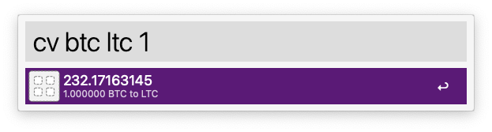

# Crypto Converter



快速转换数字货币汇率。

## 安装

[点此下载](https://github.com/ekousp/Alfred_CryptoConverter/raw/master/Crypto%20Converter.alfredworkflow)后双击导入Alfred

## 使用

```
cv {from} {to} {amount}
```

如：

* 1 BTC 转 USD：`cv btc usd 1`，可以省略为`cv`
* 10 ZEC 转 BTC：`cv zec btc 10`

